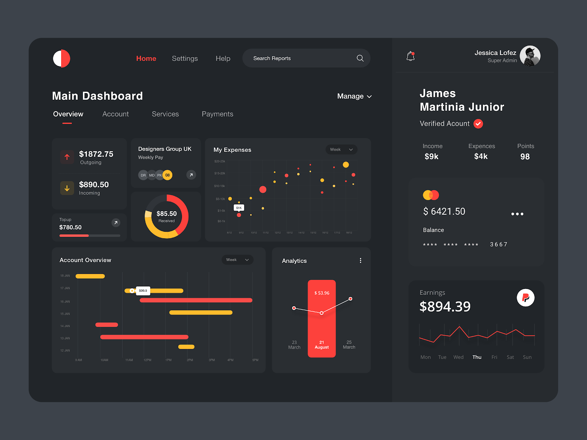

# TimberMach - Developer Guide

This repo hosts the TimberMach desktop app (React + Electron) plus the local computer-vision API (Flask). A separate Laravel API is expected at `C:\xampp\htdocs\TIMBER`.

---

## Stack at a glance
- React + Vite + Tailwind v4 (UI)
- Electron shell (`electron/main.cjs`)
- Laravel API (outside repo, served from XAMPP)
- Python/Flask CV + OCR service (`python-backend/app.py`)
- Optional hardware serial bridge (`server.js`)

---

## Agent guidelines (stick to these)
When asking an agent to work here, define requirements explicitly and limit scope to this repo:
- State the exact goal and files/areas to touch; everything else is out of scope.
- Reuse existing scripts and paths (see run/build sections); do not invent new services or move Laravel from `C:\xampp\htdocs\TIMBER`.
- Keep tooling choices fixed: Node 22.12.0, npm (no Yarn/PNPM), Python 3.11+.
- Preserve Vite/Electron settings for Warper WASM (`optimizeDeps.exclude` and `assetsInclude`); do not change `base: "./"`.
- Apply red/green TDD: add/extend tests first, confirm they fail, then make them pass; if no tests, add minimal ones.
- No secrets or credentials in commits; `.env` stays local.
These are the operative guardrails - agents should not go beyond what is written here.
- UI Should be simple, but uniform in design, no other designs, keep the current them of Navy Blue and the Dark and Light mode

- use this UI for the SpecimenView.jsx

```bash {image}
0_s4bP-d18Rg-e4EcS.png
```




## Title (SpecimenView.jsx)

The title should be the Specimen Name, followed by the Reference Species then below it is the two graphs and charts.

- Specimen Name
- Reference Species (Put "Compare Button" if none are selected)

- in the card where the Reference Species Shows, if the test was new, put the "Compare button" in the card, then replace the button into the reference specie name, and below it a button compare, just move the button there


## Graphs and Charts (SpecimenView.jsx)
In the SpecimenView.jsx, We use the following charts, graphs via D3.js, put it on top of the Cards.

- Accuracy vs Reference, use Pie Chart, 
- Moisture Content, use Doughnut Chart,

## Number cards (SpecimenView.jsx)

Make the Numbers Dominant like make the cards bigger

- Test mode 
- Experimental Stress
- Reference stress

## Table (SpecimenView.jsx)

- Specimen ID (Hide)
- Specimen Name
- Reference Species
- Test Type
- Test Date
- Last Modifie
---

## Prerequisites (Windows-first)
- Windows 10/11
- Node.js **22.12.0** (use `nvm-windows`)
- npm 10+
- Python **3.11+**
- XAMPP with PHP 8.x + MySQL at `C:\xampp`
- Composer
- Optional: Visual C++ Build Tools (fix native module installs)

---

## Install
```bash
git clone <your-repo-url>
cd Timbermach
nvm use 22.12.0
npm install
```

Python env (from repo root):
```bash
cd python-backend
python -m venv .venv
.venv\Scripts\activate
pip install -r requirements.txt
```

---

## Run the stack (one-command options)
- UI + Laravel + Python: `npm run dev:fullstack`
- UI + Laravel + Python + Electron: `npm run dev:all`
- UI only: `npm run dev` (alias `dev:react`)
- Laravel only (from repo root): `npm run dev:laravel` (serves `C:\xampp\htdocs\TIMBER`)
- Python only: `npm run dev:python`

### Individual service notes
- Laravel must live at `C:\xampp\htdocs\TIMBER`. If you relocate it, update `package.json` scripts and the Vite proxy in `vite.config.js`.
- Python service listens on `http://localhost:5000`.

---

## Environment
Root `.env` (example):
```env
VITE_API_BASE_URL=http://127.0.0.1:8000
VITE_PYTHON_API_URL=http://127.0.0.1:5000
VITE_ACTUATOR_WS_URL=ws://localhost:8080
VITE_SENSOR_WS_URL=ws://localhost:5001
VITE_MOISTURE_CAMERA_NAME="Integrated Camera"
VITE_OCR_INTERVAL_MS=0
```
Restart Vite after changes.

---

## Testing and quality
- Current repo has no automated tests. Add them with any change.
  - Frontend: prefer `vitest` + `@testing-library/react`.
  - Python: prefer `pytest` for `python-backend`.
- Follow red/green TDD: write a failing test, watch it fail, then implement until green.
- If no tests are present yet, at least run:
  - `npm run build` (frontend)
  - `python -m compileall python-backend` (syntax smoke check)

---

## Build and packaging
- Frontend build: `npm run build`
- Build to deployment folder: `npm run build:deploy`
- Electron package: `npm run package` (output in `C:\Users\Jhon_Brix\Desktop\PERSONAL-PROJECT\Deployment`)

Vite is configured with `base: "./"` so packaged Electron loads assets via `file://`. Keep the Warper WASM settings in `vite.config.js` (`optimizeDeps.exclude["@itsmeadarsh/warper"]` and `assetsInclude`) intact.

---

## Troubleshooting
- Electron install EBUSY: close running Electron windows and rerun `npm install`.
- Wrong Node version: verify `node -v` shows `v22.12.0`.
- Laravel not found: ensure `C:\xampp\htdocs\TIMBER` exists and is serving on `http://127.0.0.1:8000`.
- Styling oddities: restart Vite; if still broken, reinstall deps.

---

## Hardware bridge (optional)
Only when sensors are attached:
```bash
node server.js
```
Edit COM ports/baud inside `server.js` as needed.

---

## Data
MySQL schema/dumps live in `MySQL Tables/` and `timbemach.sql`. Import into XAMPP MySQL before running Laravel migrations.

## Directory Structure files
.
+-- electron/
|   +-- main.cjs
|   `-- preload.js
+-- MySQL Tables/
|   +-- actuator_calibrations.sql
|   +-- calibration_settings.sql
|   +-- compressive_data.sql
|   +-- flexure_data.sql
|   +-- measurement_detection_settings.sql
|   +-- reference_values.sql
|   `-- shear_data.sql
+-- python-backend/
|   +-- __pycache__/
|   |   +-- auto_detection_utils.cpython-311.pyc
|   |   +-- canny_zernike_detector.cpython-311.pyc
|   |   +-- edge_detection_utils.cpython-311.pyc
|   |   +-- seven_segment_ocr.cpython-311.pyc
|   |   +-- shape-detect.cpython-311.pyc
|   |   `-- shape_detect_api.cpython-311.pyc
|   +-- app-original.py
|   +-- app.py
|   +-- pressure_sensor.py
|   +-- requirements.txt
|   +-- seven_segment_ocr.py
|   +-- shape-detect-working-original.py
|   +-- shape-detect.py
|   +-- shape_detect_api-original.py
|   `-- shape_detect_api.py
+-- resources/
|   +-- Cards/
|   |   `-- Strength Test/
|   |       +-- Card_Default.png
|   |       +-- Compressive_Card.png
|   |       +-- Flexure_Card.png
|   |       `-- Shear_Card.png
|   `-- Sounds/
|       `-- UI/
|           `-- button_press_Beep.mp3
+-- src/
|   +-- components/
|   |   +-- Dash/
|   |   |   +-- Dash.jsx
|   |   |   +-- SpecimenComparison.jsx
|   |   |   +-- SpecimenEdit.jsx
|   |   |   +-- SpecimenView.jsx
|   |   |   `-- stress.js
|   |   +-- Header/
|   |   |   `-- Header.jsx
|   |   +-- Settings/
|   |   |   +-- ReferenceValues/
|   |   |   |   +-- ReferenceValues.jsx
|   |   |   |   +-- RVEdit.jsx
|   |   |   |   `-- RVView.jsx
|   |   |   +-- ActuatorCalibration.jsx
|   |   |   +-- ActuatorControl.jsx
|   |   |   +-- ActuatorDefaultSettings.js
|   |   |   +-- BackendStatusIndicator.jsx
|   |   |   +-- MeasurementSettings.jsx
|   |   |   +-- MeasurementSettingsDetail.jsx
|   |   |   +-- MeasurementSettingsList.jsx
|   |   |   +-- MoistureDebug.jsx
|   |   |   +-- MoistureSettings copy.jsx
|   |   |   +-- MoistureSettings.jsx
|   |   |   +-- Settings.jsx
|   |   |   +-- SevenSegmentCalibration-old-2.jsx
|   |   |   +-- SevenSegmentCalibration.jsx
|   |   |   `-- SevenSegmentCalibration.jsx.old
|   |   +-- Tests/
|   |   |   +-- Backup of Sub-Pixel Detection/
|   |   |   |   +-- Backup 1/
|   |   |   |   |   +-- EdgeDetectionUtils.js
|   |   |   |   |   +-- Measurement.jsx
|   |   |   |   |   +-- MeasurementUtils.js
|   |   |   |   |   `-- ZernikeMoments.js
|   |   |   |   +-- Backup 2/
|   |   |   |   |   +-- DirectionalInterpolation.js
|   |   |   |   |   +-- EdgeIntegration.js
|   |   |   |   |   +-- EdgeModel.js
|   |   |   |   |   +-- ImprovedEdgeDetection.js
|   |   |   |   |   `-- ZernikeConstants.js
|   |   |   |   +-- Backup 3/
|   |   |   |   |   +-- EdgeDetectionUtils.js
|   |   |   |   |   `-- ZernikeMoments.js
|   |   |   |   `-- Base files/
|   |   |   |       +-- EdgeDetectionUtils copy.js
|   |   |   |       `-- Measurement copy.jsx
|   |   |   +-- Test/
|   |   |   +-- KiloNewtonGuage-with-sensor.jsx
|   |   |   +-- KiloNewtonGuage.jsx
|   |   |   +-- KiloNewtonGuagebackup.jsx
|   |   |   +-- Measurement-old.jsx
|   |   |   +-- Measurement-original.jsx
|   |   |   +-- Measurement.jsx
|   |   |   +-- MoistureTest copy.jsx
|   |   |   +-- MoistureTest-Final.jsx
|   |   |   +-- MoistureTest.jsx
|   |   |   +-- TestSummary.jsx
|   |   |   +-- WoodTests.css
|   |   |   `-- WoodTests.jsx
|   |   +-- GlobalKeyboardProvider.jsx
|   |   `-- VirtualKeyboard.jsx
|   +-- config/
|   |   +-- measurementSettings.js
|   |   `-- servers.js
|   +-- Utils/
|   |   `-- TouchControls.js
|   +-- workers/
|   |   `-- pressureWorker.js
|   +-- App.css
|   +-- App.jsx
|   `-- main.jsx
+-- .gitignore
+-- AGENT.md
+-- fix_calibration.sql
+-- index.html
+-- package.json
+-- postcss.config.js
+-- project-scan.txt
+-- README.md
+-- Rebuild-Exe.bat
+-- requirements.txt
+-- serialCommunication.js
+-- server copy.js
+-- server.js
+-- tailwind.config.js
+-- temp_slice.txt
+-- timbemach.sql
+-- Timbermach-Launcher.bat
+-- timbermach-v0.0.1.tgz
+-- Timbermach.bat
`-- vite.config.js

